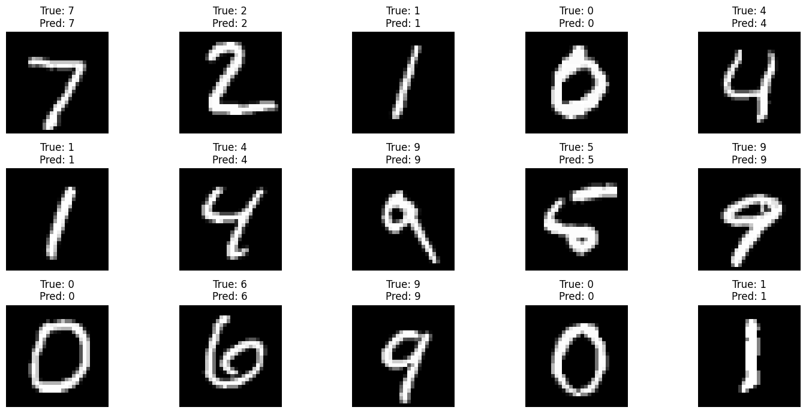
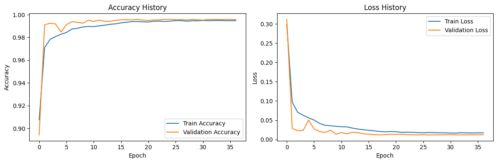
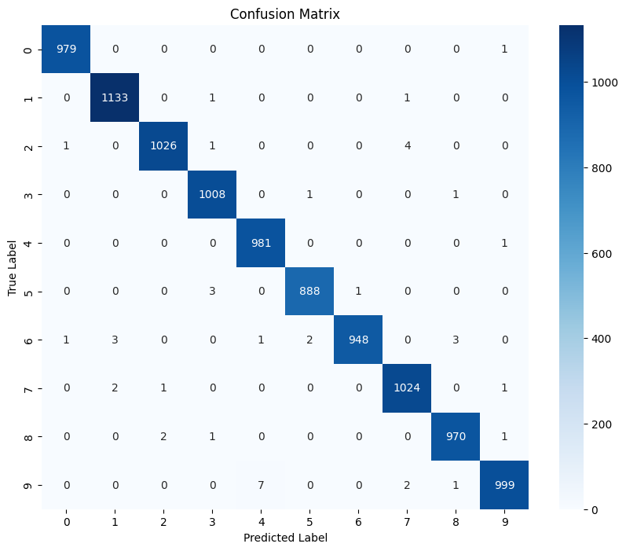

# MNIST Digit Classification with Convolutional Neural Network (CNN)

 <!-- Replace with your actual image name -->

A high-performance CNN model achieving 99.56% accuracy on the MNIST test set, implementing best practices in deep learning and thorough post-training analysis.

## Key Features
- **99.56% Test Accuracy** on MNIST dataset
- Detailed training history visualization
- Comprehensive confusion matrix analysis
- Robust data augmentation pipeline
- Modern CNN architecture with batch normalization and dropout
- Full model persistence and deployment-ready implementation

## Results
### Model Performance
- **Test Accuracy:** 99.56%
- **Test Loss:** 0.0116
- **Classification Report:**
Classification Report:
              precision    recall  f1-score   support

           0       1.00      1.00      1.00       980
           1       1.00      1.00      1.00      1135
           2       1.00      0.99      1.00      1032
           3       0.99      1.00      1.00      1010
           4       0.99      1.00      1.00       982
           5       1.00      1.00      1.00       892
           6       1.00      0.99      0.99       958
           7       0.99      1.00      0.99      1028
           8       0.99      1.00      1.00       974
           9       1.00      0.99      0.99      1009

      accuracy                         1.00     10000
      macro avg    1.00      1.00      1.00     10000
      weighted avg 1.00      1.00      1.00     10000

### Visualizations
1. **Training History**  
  <!-- Replace with your plot filename -->
 - Accuracy progression (training vs validation)
 - Loss progression (training vs validation)

2. **Confusion Matrix**  
  <!-- Replace with your plot filename -->
 - Detailed class-wise performance analysis
 - Visual representation of prediction patterns
